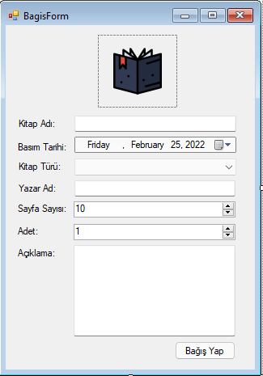
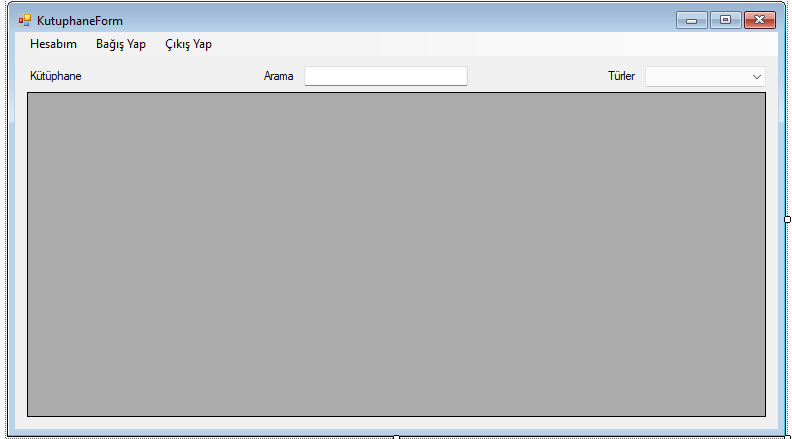
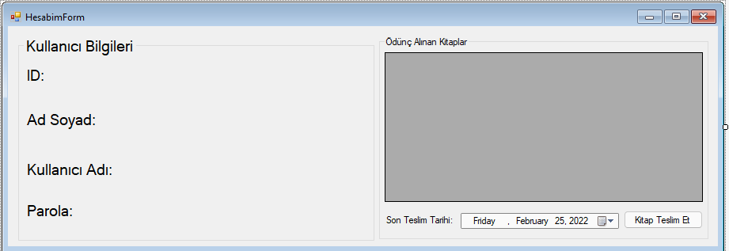

### Yapılacaklar 
- [X] Data katmanına ilgili classların oluşturulması
	- Kitap
        - Id Guid (contructor'da otomaik değer atansın.)
        - Ad string
        - BasimTarihi DateTime
        - KitapTurEnum KitapTuru
        - YazarAd string
        - SayfaSayisi int
        - Aciklama string
        - DateTime? OduncAlinmaTarihi
    - KitapTurEnum
        - Egitim,Psikoloji,Korku,Biyografi,....
    - Kullanıcı
        - Id Guid (contructor'da otomaik değer atansın.)
        - AdSoyad string
        - KullaniciAdi string
        - Parola string
        - List< Kitap > OduncAlinanKitaplar
    - KullanıcıYontecisi
        - Kullanıcı listesi olmalı ve tüm işlemler bu liste üzerinden yapılmalı.
        - KayıtOl methodu
        - GirisYap methodu
        - KullaniciVarMi methodu
    - KutuphaneYoneticisi
        - Kitap listesi olmalı ve tüm işlemler bu liste üzerinden yapılmalı.
        - KitapBagisYap methodu
        - KitapImhaEt methodu
        - KitapOduncAl methodu parametre kullanıcı ve kitap
- [X] Register ve Login sayfalarının tasarlanması
    - Görsel tasarımın yapılması.
    - Register sayfasında parola eşleşme kontrolü
    - Aynı kullanıcı adına sahip kişi var mı kontrolü
    - Register ve login işlemleri methodlar kullanılarak
    - Login başarılıysa KutuphaneForm acilsin. 
    - LoginForm açılır ve kapanırken Kullanıcıyoneticisini serialize ve deserialize ediniz.
- [X] KutuphaneForm
    - KutuphaneForm açılır ve kapanırken kutuphaneyoneticisi serialize ve deserialize edilir.
    - Kutuphaneform'da menustripdeki butonlara tıklandığında ilgili formların açılması.
    - Çıkış yap özelliği 
    - Context menu strip kullanılarak kitap imha et ve kitap ödünç al özelliklerinin eklenmesi.
    - txt arama ve combobox turlerdeki seçim ve text değiştiğinde datagridviewde ilgili kitapların listelenmesi.
- [X] HesabımForm
    - HesabımSayfasında giriş yapan kullanıcı bilgileri gösterilir.
- [X] BagisYap Form
    - BagisYap fromda ilgili kitap bilgileri alınarak bir kitap kutuphanedeki kitaplara eklenir.
- [X] Çıkış Yap  Butonu
    - Kutuphane formu kapatarak loginforma geri döner ve başka bir kullanıcı ile giriş yapma imkanı sağlar.
- [ ] Ekstra Görev:
    - Kullanıcının ödünç aldığı kitabın teslim süresi geçtiğinde nasıl bir sistem tasaralayabiliriz?
#### Örnek tasarım
- BagisYap Form

- Kutuphane Form

- Hesabim Form

